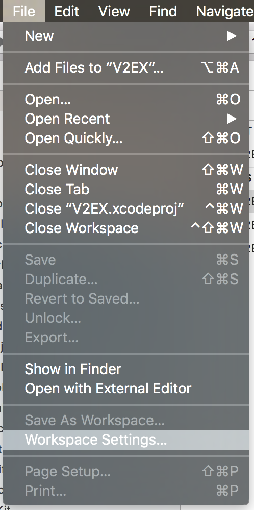
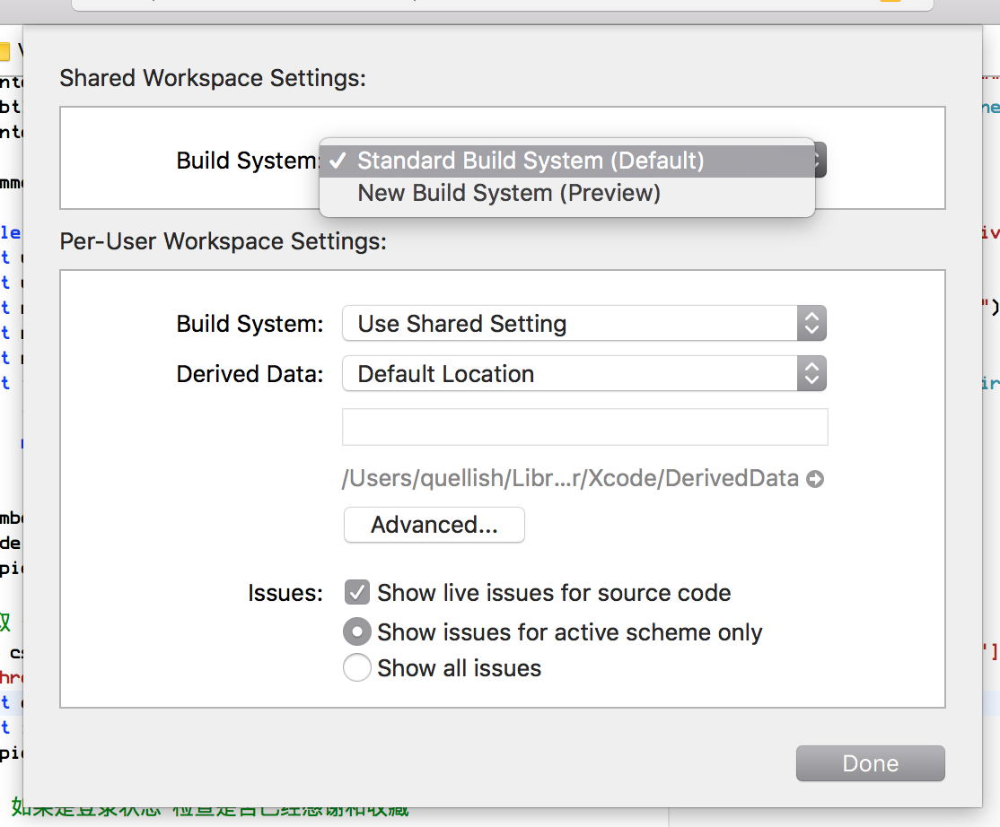

In Xcode 9 Apple [quietly introduced a new build system].  This is a “preview” and is not enabled by default. It promises improvements in build times as well as changes to how object dependencies in Swift are handled. 
[Circular dependencies] have long been a major pain point for Swift developers. They can cause unpredictable behavior when editing, long build times, and Xcode crashes.

##Is it really faster?
V2EX is an open source application that is fairly representative of the projects I see Swift developers writing. A quick look at it showed it uses a mix of about 20 third party CocoaPod libraries. These are a mix of Objective-C and Swift. The core V2EX application itself has over 1800 dependency cycles. That seems to be typical for a Swift application of this size. 

I would have preferred to used an application written in Swift 4, but I could not find any. Bummer.

I tested clean builds, incremental builds, and incremental builds with a set of source changes inside the core application. The source changes were scripted and repeatable. Both the default build system and the new build system were run through these tests 100 times.

The new build system was on average **28% faster with clean builds and 82% faster on incremental builds**. 
“Live issues” during editing are a major pain point for Swift. The tools crash, issue presentation is slow and often just plain wrong. While there is no way to measure the performance of live issues, it was clearly faster and more stable during editing than the default build system.

##Using the new build system in your project

Open your project or workspace in Xcode.
In the **File** menu, select **Workspace Settings…** If this is not a workspace, this will be Project Settings.

This will display the **Workspace Settings** sheet where you can switch between build system. Select the **New Build System (Preview)**

That’s it! Building your project should be X percent faster now. An added benefit is that live editing and code completion should also be faster and more stable. 